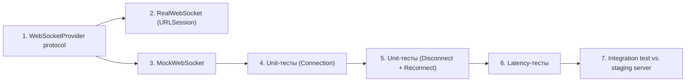

# WebSocket Test Plan — Live Voice Translator

## 1. Цель

Обеспечить надёжность WebSocket-канала между iOS-приложением и Gemini Live API:
- корректное установление / разрыв соединения,
- автоматическое переподключение при обрывах,
- допустимая задержка (latency) для real-time голосового перевода.

---

## 2. Тестовое окружение

| Компонент | Реализация |
|---|---|
| **WebSocket-клиент** | `URLSessionWebSocketTask` (native) |
| **Мок-сервер** | Локальный WebSocket-сервер на Python (`websockets`) или встроенный `NWListener` |
| **Сетевые условия** | Network Link Conditioner (macOS) / `NWPathMonitor` mock |
| **CI** | Xcode Cloud / GitHub Actions (macOS runner) |

---

## 3. Категории тестов

### 3.1 Подключение (Connection)

| # | Сценарий | Ожидание | Приоритет |
|---|---|---|---|
| C-1 | Подключение к валидному URL | Состояние = `.connected` за < 3 с | 🔴 High |
| C-2 | Подключение к невалидному URL | Ошибка + делегат получает `.error` | 🔴 High |
| C-3 | Двойной вызов `connect()` | Второй вызов игнорируется (idempotent) | 🟡 Medium |
| C-4 | `disconnect()` после успешного подключения | Состояние = `.disconnected`, сервер получает Close frame | 🔴 High |

### 3.2 Обрыв связи (Disconnection)

| # | Сценарий | Ожидание | Приоритет |
|---|---|---|---|
| D-1 | Сервер закрывает соединение (Close frame) | Клиент получает `onDisconnect`, state = `.disconnected` | 🔴 High |
| D-2 | Сеть пропадает (Wi-Fi off / Airplane mode) | `NWPathMonitor` → `.unsatisfied` → обработчик вызывается | 🔴 High |
| D-3 | Сервер не отвечает на ping > 10 с | Timeout → соединение считается потерянным | 🟡 Medium |
| D-4 | Обрыв во время отправки аудио-чанка | Чанк буферизуется, после reconnect — досылается | 🟡 Medium |

### 3.3 Переподключение (Reconnection)

| # | Сценарий | Ожидание | Приоритет |
|---|---|---|---|
| R-1 | Автоматическое переподключение после обрыва | Новое соединение установлено за < 5 с | 🔴 High |
| R-2 | Экспоненциальный backoff | Задержки: 1 с → 2 с → 4 с → 8 с → max 30 с | 🔴 High |
| R-3 | Максимум попыток (5) | После 5 неудач — состояние `.failed`, UI показывает ошибку | 🟡 Medium |
| R-4 | Сеть восстановилась (`NWPath` → `.satisfied`) | Немедленная попытка подключения | 🔴 High |
| R-5 | Отмена reconnect пользователем | Таймер отменяется, новых попыток нет | 🟢 Low |

### 3.4 Задержка (Latency)

| # | Сценарий | Ожидание | Приоритет |
|---|---|---|---|
| L-1 | Ping-Pong RTT (локальный сервер) | < 50 мс | 🔴 High |
| L-2 | Ping-Pong RTT (prod, хорошая сеть) | < 200 мс | 🔴 High |
| L-3 | Ping-Pong RTT (3G / плохая сеть) | < 500 мс (предупреждение в UI) | 🟡 Medium |
| L-4 | Отправка 1 с аудио (32 KB Base64) + ответ | End-to-end < 1.5 с | 🟡 Medium |
| L-5 | Стресс: 60 с непрерывной трансляции | Средняя задержка не деградирует > 20 % | 🟡 Medium |

---

## 4. Подход к мокированию

```
┌─────────────┐       protocol        ┌──────────────────┐
│  Test Case   │ ──────────────────── │ WebSocketProvider │ (protocol)
└─────────────┘                       └──────────────────┘
                                           ▲         ▲
                                           │         │
                              ┌────────────┘         └────────────┐
                              │                                    │
                    ┌─────────────────┐                ┌───────────────────┐
                    │  MockWebSocket   │                │  RealWebSocket     │
                    │  (unit tests)    │                │  (URLSession-based)│
                    └─────────────────┘                └───────────────────┘
```

**`WebSocketProvider`** — протокол с методами:
- `connect(url:)`
- `disconnect()`
- `send(data:)`
- `onMessage`, `onConnect`, `onDisconnect`, `onError` (closures / Combine publishers)

**`MockWebSocket`** — имитирует поведение сервера:
- `simulateServerMessage(_:)` — подаёт сообщение «от сервера»
- `simulateDisconnect(code:)` — имитирует обрыв
- `simulateLatency(_: TimeInterval)` — задерживает ответ

---

## 5. Порядок реализации



| Этап | Ожидание |
|---|---|
| 1–3 | Sprint 1, Day 2–3 |
| 4–5 | Sprint 1, Day 3–4 |
| 6   | Sprint 1, Day 5 |
| 7   | Sprint 2, Day 1 |

---

## 6. Критерии Ready / Done

- **Ready**: MockWebSocket реализован, все тесты из таблиц C, D, R, L написаны как `XCTSkip`.
- **Done**: Все тесты зелёные, coverage > 80 % для `WebSocketService`.
