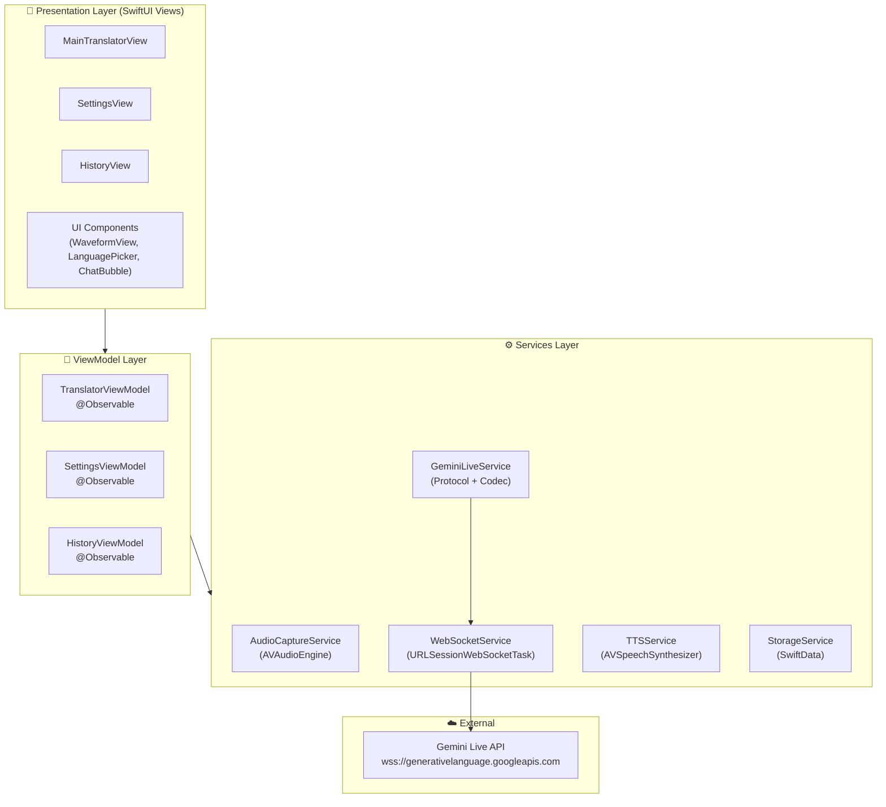
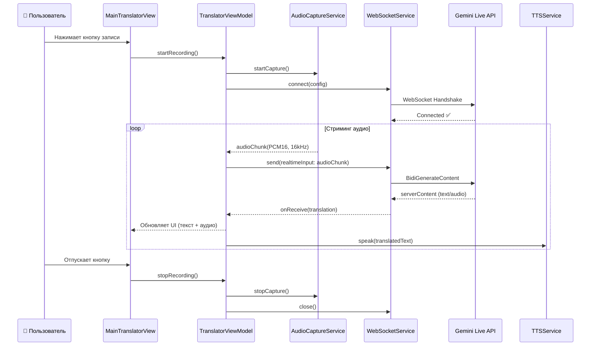

# 🎙️ Jarvis Voice System — Roadmap & Architecture

> **Дата создания:** 26 февраля 2026  
> **Платформа:** iOS 17+  
> **Язык:** Swift 5.9+, SwiftUI  
> **Архитектура:** MVVM + Services Layer  
> **API:** Gemini Live API (WebSocket, Multimodal)

---

## 1. Высокоуровневая архитектура (MVVM)

### 1.1 Диаграмма слоёв



### 1.2 Описание слоёв

| Слой | Ответственность | Ключевые технологии |
|------|----------------|---------------------|
| **Presentation** | Отображение UI, анимации, пользовательский ввод | SwiftUI, Custom Shapes, Haptics |
| **ViewModel** | Бизнес-логика, управление состоянием, координация сервисов | `@Observable` (Observation framework) |
| **Services** | Изолированные сервисы с конкретной функцией | AVFoundation, URLSession, SwiftData |
| **External** | Внешние API | Gemini Live API (WebSocket) |

### 1.3 Структура проекта

```
LiveVoiceTranslator/
├── App/
│   ├── LiveVoiceTranslatorApp.swift        # Entry point
│   └── AppConfiguration.swift              # API keys, feature flags
│
├── Models/
│   ├── TranslationMessage.swift            # Модель сообщения
│   ├── Language.swift                      # Enum поддерживаемых языков
│   ├── TranslationSession.swift            # Сессия перевода
│   └── AudioChunk.swift                    # Модель аудио-фрагмента
│
├── ViewModels/
│   ├── TranslatorViewModel.swift           # Основная логика перевода
│   ├── SettingsViewModel.swift             # Управление настройками
│   └── HistoryViewModel.swift              # Управление историей
│
├── Views/
│   ├── MainTranslatorView.swift            # Главный экран
│   ├── SettingsView.swift                  # Настройки
│   ├── HistoryView.swift                   # История переводов
│   └── Components/
│       ├── WaveformView.swift              # Визуализация аудио
│       ├── LanguagePickerView.swift         # Выбор языков
│       ├── ChatBubbleView.swift            # Пузырь чата
│       ├── RecordButton.swift              # Кнопка записи
│       └── TranslationCardView.swift        # Карточка перевода
│
├── Services/
│   ├── Audio/
│   │   ├── AudioCaptureService.swift       # Захват аудио (AVAudioEngine)
│   │   └── AudioProcessingService.swift    # Конвертация PCM → формат API
│   ├── Network/
│   │   ├── WebSocketService.swift          # WebSocket-менеджер
│   │   └── GeminiLiveService.swift         # Протокол Gemini Live API
│   ├── TTS/
│   │   └── TTSService.swift               # Озвучка перевода
│   └── Storage/
│       └── StorageService.swift            # SwiftData persistence
│
├── Utilities/
│   ├── Constants.swift                     # Константы приложения
│   ├── Logger.swift                        # Unified logging
│   └── Extensions/
│       ├── Data+Audio.swift                # Расширения для аудио-данных
│       └── String+Localization.swift       # Локализация
│
└── Resources/
    ├── Assets.xcassets                     # Иконки, цвета
    ├── Localizable.xcstrings               # Строковые ресурсы
    └── Info.plist                          # Разрешения (микрофон, речь)
```

---

## 2. Ключевые потоки данных

### 2.1 Поток реального перевода



### 2.2 Формат сообщений Gemini Live API

```json
// → Клиент: Setup (первое сообщение)
{
  "setup": {
    "model": "models/gemini-2.5-flash-native-audio-preview-12-2025",
    "generationConfig": {
      "responseModalities": ["TEXT", "AUDIO"],
      "speechConfig": {
        "voiceConfig": {
          "prebuiltVoiceConfig": {
            "voiceName": "Aoede"
          }
        }
      }
    },
    "systemInstruction": {
      "parts": [{
        "text": "You are a real-time voice translator. Translate speech from {sourceLang} to {targetLang}. Respond with ONLY the translation, no explanations."
      }]
    }
  }
}

// → Клиент: Аудио-данные (стриминг)
{
  "realtimeInput": {
    "mediaChunks": [{
      "mimeType": "audio/pcm;rate=16000",
      "data": "<base64-encoded-PCM>"
    }]
  }
}

// ← Сервер: Ответ
{
  "serverContent": {
    "modelTurn": {
      "parts": [
        { "text": "Translated text here" },
        { "inlineData": { "mimeType": "audio/pcm;rate=24000", "data": "<base64>" } }
      ]
    }
  }
}
```

---

## 3. Sprint 1 — MVP (2 недели)

### 🎯 Цель спринта
Работающий прототип: пользователь нажимает кнопку → говорит → видит и слышит перевод в реальном времени.

### 3.1 Разбивка по дням

| День | Задача | Статус |
|------|--------|--------|
| **1–2** | Настройка проекта, архитектура папок, базовые модели | ✅ |
| **3–4** | UI главного экрана (SwiftUI), компоненты | ✅ |
| **5–6** | AudioCaptureService — захват и конвертация аудио | ✅ |
| **7–8** | WebSocketService + GeminiLiveService — подключение к API | ✅ |
| **9–10** | TranslatorViewModel — связка сервисов, основной поток | ✅ |
| **11–12** | TTSService — озвучка перевода | ✅ |
| **13** | Интеграционное тестирование, баг-фикс | ✅ |
| **14** | Полировка UI, демо | ✅ |

---

### 3.2 Детальные задачи Sprint 1

#### 📦 Этап 1: Настройка проекта (Дни 1–2)

- [ ] Создать Xcode проект (iOS App, SwiftUI, Swift)
- [ ] Настроить минимальную версию iOS 17.0
- [ ] Организовать файловую структуру (см. раздел 1.3)
- [ ] Создать `AppConfiguration.swift` для хранения API-ключей (через `.xcconfig`)
- [ ] Настроить `Info.plist`:
  - `NSMicrophoneUsageDescription`
  - `NSSpeechRecognitionUsageDescription`
- [ ] Создать базовые модели: `Language`, `TranslationMessage`, `AudioChunk`
- [ ] Настроить `Logger` через `os.Logger`
- [ ] Инициализировать Git-репозиторий + `.gitignore`

#### 🎨 Этап 2: UI главного экрана (Дни 3–4)

- [ ] Создать `MainTranslatorView` с layout:
  - Верхняя панель: выбор пары языков + кнопка swap
  - Центр: область чата/перевода
  - Низ: кнопка записи (Push-to-Talk)
- [ ] Реализовать `LanguagePickerView` (Picker с флагами)
- [ ] Реализовать `RecordButton` с анимацией (пульсация при записи)
- [ ] Реализовать `WaveformView` — визуализация громкости в реальном времени
- [ ] Реализовать `ChatBubbleView` — отображение оригинала и перевода
- [ ] Применить дизайн-систему: цвета, шрифты, скругления
- [ ] Обеспечить поддержку Dark Mode

#### 🎤 Этап 3: Захват аудио (Дни 5–6)

- [ ] Реализовать `AudioCaptureService`:
  - Инициализация `AVAudioEngine`
  - Запрос разрешения на микрофон
  - Захват PCM16, 16kHz, mono
  - Publish аудио-чанков через `AsyncStream<Data>`
- [ ] Реализовать `AudioProcessingService`:
  - Конвертация в формат, совместимый с Gemini API
  - Base64-кодирование чанков
- [ ] Обработка прерываний аудиосессии (звонки, другие приложения)
- [ ] Unit-тесты для конвертации аудио

#### 🌐 Этап 4: WebSocket + Gemini Live API (Дни 7–8)

- [ ] Реализовать `WebSocketService`:
  - Подключение через `URLSessionWebSocketTask`
  - Автоматический reconnect при обрыве
  - Ping/Pong для keep-alive
  - Обработка ошибок и таймаутов
- [ ] Реализовать `GeminiLiveService`:
  - Формирование `setup` сообщения (модель, конфиг, system prompt)
  - Отправка `realtimeInput` с аудио-чанками
  - Парсинг `serverContent` ответов
  - Обработка `toolCall` (если потребуется)
  - Управление сессией (start/stop/resume)
- [ ] Конфигурация endpoint: `wss://generativelanguage.googleapis.com/ws/google.ai.generativelanguage.v1beta.GenerativeService.BidiGenerateContent`
- [ ] Обработка ошибок API (rate limits, auth errors)

#### 🧠 Этап 5: ViewModel — Интеграция (Дни 9–10)

- [ ] Реализовать `TranslatorViewModel`:
  - Состояния: `.idle`, `.connecting`, `.recording`, `.translating`, `.error`
  - Координация между Audio → WebSocket → UI
  - Буферизация входящего текста для плавного отображения
  - Управление жизненным циклом сессии
- [ ] Подключить ViewModel к `MainTranslatorView`
- [ ] Реализовать обработку ошибок с user-friendly сообщениями
- [ ] Добавить Haptic feedback при ключевых событиях

#### 🔊 Этап 6: Text-to-Speech (Дни 11–12)

- [ ] Реализовать `TTSService`:
  - Воспроизведение аудио от Gemini (PCM24kHz)
  - Fallback на `AVSpeechSynthesizer` при отсутствии аудио от API
  - Очередь фраз для последовательного воспроизведения
  - Управление громкостью и скоростью
- [ ] Переключение между встроенным TTS и Gemini Audio
- [ ] Обработка конфликтов с аудиосессией (наушники, динамик)

#### 🧪 Этап 7: Тестирование и полировка (Дни 13–14)

- [ ] End-to-end тестирование полного потока перевода
- [ ] Тестирование на реальном устройстве (микрофон + динамик)
- [ ] Проверка edge-cases: нет интернета, таймаут API, отказ в разрешениях
- [ ] Полировка анимаций и переходов
- [ ] Оптимизация потребления батареи
- [ ] Подготовка демо-видео

---

## 4. Задачи для команды

### 👨‍💻 iOS-разработчик

| # | Задача | Приоритет | Оценка | Зависимости |
|---|--------|-----------|--------|-------------|
| **DEV-001** | Создать Xcode проект и файловую структуру | 🔴 Critical | 2ч | — |
| **DEV-002** | Реализовать базовые модели (`Language`, `TranslationMessage`, `AudioChunk`) | 🔴 Critical | 3ч | DEV-001 |
| **DEV-003** | Реализовать `AudioCaptureService` (AVAudioEngine, PCM16 16kHz) | 🔴 Critical | 8ч | DEV-001 |
| **DEV-004** | Реализовать `WebSocketService` (URLSessionWebSocketTask) | 🔴 Critical | 6ч | DEV-001 |
| **DEV-005** | Реализовать `GeminiLiveService` (setup, streaming, parsing) | 🔴 Critical | 10ч | DEV-004 |
| **DEV-006** | Реализовать `TranslatorViewModel` (координация всех сервисов) | 🔴 Critical | 8ч | DEV-003, DEV-005 |
| **DEV-007** | Реализовать `TTSService` (воспроизведение Gemini audio + fallback) | 🟡 High | 6ч | DEV-005 |
| **DEV-008** | Собрать `MainTranslatorView` по макетам дизайнера | 🟡 High | 8ч | DESIGN-002 |
| **DEV-009** | Реализовать `WaveformView` (визуализация аудио) | 🟢 Medium | 4ч | DEV-003 |
| **DEV-010** | Реализовать `RecordButton` с анимацией пульсации | 🟢 Medium | 3ч | DESIGN-003 |
| **DEV-011** | Интеграционное тестирование + баг-фикс | 🟡 High | 8ч | DEV-006, DEV-007, DEV-008 |
| **DEV-012** | Настроить `.xcconfig` для API-ключей (dev/prod) | 🟢 Medium | 2ч | DEV-001 |

**Общая оценка для разработчика:** ~68 часов (≈ 8.5 рабочих дней)

---

### 🎨 UI/UX Дизайнер

| # | Задача | Приоритет | Оценка | Зависимости |
|---|--------|-----------|--------|-------------|
| **DESIGN-001** | Исследование конкурентов (Apple Translate, Google Translate, DeepL) | 🟡 High | 4ч | — |
| **DESIGN-002** | Дизайн главного экрана (Figma): layout, выбор языков, область перевода | 🔴 Critical | 8ч | DESIGN-001 |
| **DESIGN-003** | Дизайн кнопки записи + состояния (idle, recording, processing) | 🔴 Critical | 3ч | DESIGN-001 |
| **DESIGN-004** | Дизайн визуализации аудио (waveform / orb / bars) | 🟡 High | 3ч | DESIGN-001 |
| **DESIGN-005** | Определить дизайн-систему: палитра, типографика, иконки, отступы | 🔴 Critical | 4ч | DESIGN-001 |
| **DESIGN-006** | Дизайн пузырей чата (входящее/исходящее, оригинал/перевод) | 🟡 High | 3ч | DESIGN-002 |
| **DESIGN-007** | Дизайн состояний ошибок и пустых экранов | 🟢 Medium | 2ч | DESIGN-002 |
| **DESIGN-008** | Micro-анимации и transitions (Lottie/SwiftUI Animation) | 🟢 Medium | 4ч | DESIGN-002, DESIGN-003 |
| **DESIGN-009** | Дизайн App Icon + Splash Screen | 🟢 Medium | 3ч | DESIGN-005 |
| **DESIGN-010** | Dark Mode адаптация всех экранов | 🟡 High | 2ч | DESIGN-002 |

**Общая оценка для дизайнера:** ~36 часов (≈ 4.5 рабочих дней)

---

## 5. Технологический стек

| Компонент | Технология | Обоснование |
|-----------|------------|-------------|
| UI фреймворк | SwiftUI | Нативный, декларативный, поддержка iOS 17+ |
| Архитектура | MVVM + `@Observable` | Observation framework (iOS 17), чистое разделение |
| Аудио захват | AVAudioEngine | Низкоуровневый контроль, стриминг PCM |
| WebSocket | URLSessionWebSocketTask | Нативный, без зависимостей |
| AI API | Gemini 2.0 Flash Live | Мультимодальный, реальное время, low-latency |
| TTS | AVSpeechSynthesizer + Gemini Audio | Двойная стратегия: API audio + системный fallback |
| Хранение | SwiftData | Нативный ORM, интеграция с SwiftUI |
| Логирование | os.Logger | Системный, производительный |
| Конфигурация | .xcconfig | Безопасное хранение ключей |

---

## 6. Риски и митигация

| Риск | Вероятность | Влияние | Митигация |
|------|-------------|---------|-----------|
| Задержка WebSocket > 500ms | Средняя | Высокое | Оптимизация размера чанков, сжатие |
| Ограничения API rate limit | Средняя | Высокое | Экспоненциальный backoff, кэширование |
| Качество перевода разговорной речи | Высокая | Среднее | Тюнинг system prompt, контекстное окно |
| Потребление батареи | Средняя | Среднее | Оптимизация интервала отправки, adaptive quality |
| Проблемы с аудиосессией (звонки) | Низкая | Среднее | Graceful interruption handling |

---

## 7. Метрики успеха MVP

| Метрика | Целевое значение |
|---------|------------------|
| Время до первого перевода (cold start) | < 3 секунды |
| Задержка перевода (end-to-end) | < 1.5 секунды |
| Crash-free rate | > 99% |
| Поддержка языковых пар | Минимум 10 языков |
| Точность перевода (субъективная оценка) | > 85% |

---

## 8. Дальнейшие спринты (Preview)

| Спринт | Фокус |
|--------|-------|
| **Sprint 2** | Настройки, история переводов (SwiftData), выбор голоса |
| **Sprint 3** | Офлайн-разговорник, Conference Mode (несколько участников) |
| **Sprint 4** | Onboarding, подписка (StoreKit 2), аналитика |
| **Sprint 5** | Apple Watch companion, виджеты, Siri Shortcuts |
